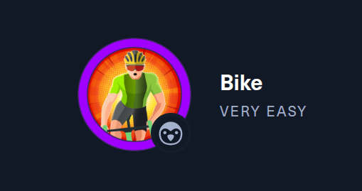

# BIKE



#customapplications #NodeJS #reconnaissance #remotecodeexecution #serversidetemplateinjectionSSTI

## 1. Méthodologie

## 2. Questions

### Task 1

What TCP ports does nmap identify as open? Answer with a list of ports seperated by commas with no spaces, from low to high.

```
22,80
```

### Task 2

What software is running the service listening on the http/web port identified in the first question?

```
node.js
```

### Task 3

What is the name of the Web Framework according to Wappalyzer?

```
express
```

### Task 4

What is the name of the vulnerability we test for by submitting {{7*7}}?

```
server side template injection
```

### Task 5

What is the templating engine being used within Node.JS?

```
handlebars
```

### Task 6

What is the name of the BurpSuite tab used to encode text?

```
decoder
```

### Task 7

In order to send special characters in our payload in an HTTP request, we'll encode the payload. What type of encoding do we use?

```
url
```

### Task 8

When we use a payload from HackTricks to try to run system commands, we get an error back. What is "not defined" in the response error?

```
require
```

### Task 9

What variable is traditionally the name of the top-level scope in the browser context, but not in Node.JS?

```
global
```

### Task 10

By exploiting this vulnerability, we get command execution as the user that the webserver is running as. What is the name of that user?

```
root
```

### Flag

```
6b258d726d287462d60c103d0142a81c
```
