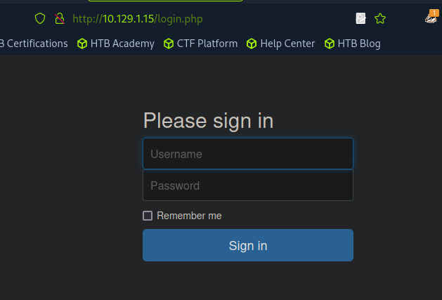
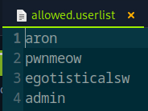
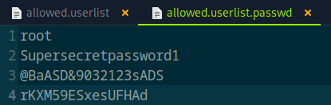
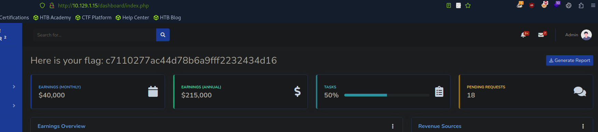

# CROCODILE


#customapplications #protocols #apache #FTP #reconnaissance #websitestructurediscovery #cleartextcredentials #anonymous/guestaccess

## 1. Méthodologie

D'abord, on commence par la phase d'énumération. Cette fois-ci, on spécifie l'option `sC` avec NMAP afin de lui indiquer d'utiliser les scripts par défaut. Ces scripts vont nous permettent d'obtenir des infos supplémentaires très utiles. La commande est donc `nmap -sV -sC -p- IP_cible`:

```
└──╼ [★]$ nmap -sV -sC -p- 10.129.1.15
Starting Nmap 7.94SVN ( https://nmap.org ) at 2025-02-23 15:39 CST
Nmap scan report for 10.129.1.15
Host is up (0.0089s latency).
Not shown: 65533 closed tcp ports (reset)
PORT   STATE SERVICE VERSION
21/tcp open  ftp     vsftpd 3.0.3
| ftp-anon: Anonymous FTP login allowed (FTP code 230)
| -rw-r--r--    1 ftp      ftp            33 Jun 08  2021 allowed.userlist
|_-rw-r--r--    1 ftp      ftp            62 Apr 20  2021 allowed.userlist.passwd
| ftp-syst: 
|   STAT: 
| FTP server status:
|      Connected to ::ffff:10.10.15.28
|      Logged in as ftp
|      TYPE: ASCII
|      No session bandwidth limit
|      Session timeout in seconds is 300
|      Control connection is plain text
|      Data connections will be plain text
|      At session startup, client count was 2
|      vsFTPd 3.0.3 - secure, fast, stable
|_End of status
80/tcp open  http    Apache httpd 2.4.41 ((Ubuntu))
|_http-server-header: Apache/2.4.41 (Ubuntu)
|_http-title: Smash - Bootstrap Business Template
Service Info: OS: Unix
```
Voici une comparaison avec la sortie habituelle de la commande `nmap -sV -p- IP_cible`:

```
└──╼ [★]$ nmap -sV -p- 10.129.1.15
Starting Nmap 7.94SVN ( https://nmap.org ) at 2025-02-23 16:03 CST
Nmap scan report for 10.129.1.15
Host is up (0.0090s latency).
Not shown: 65533 closed tcp ports (reset)
PORT   STATE SERVICE VERSION
21/tcp open  ftp     vsftpd 3.0.3
80/tcp open  http    Apache httpd 2.4.41 ((Ubuntu))
Service Info: OS: Unix
```
Nous pouvons voir que toutes les infos qui nous aiguillent directement vers le port 21 sont essentielles car, sans cela, nous pourrions tourner en rond un petit moment (en commençant par le site web) !

Le port 21 est donc ouvert et la commande nous précise même que la connexion en tant qu'utilisateur par défaut (anonymous) est autorisée. De plus je vois déjà que je peux accéder à des fichiers avec soi-disant des noms d'utilisateurs avec des mots de passe. Je vais donc tenter de me connecter avec anonymous, et sans mot de passe: `ftp IP_cible`

```
└──╼ [★]$ ftp 10.129.1.15
Connected to 10.129.1.15.
220 (vsFTPd 3.0.3)
Name (10.129.1.15:root): anonymous
230 Login successful.
Remote system type is UNIX.
Using binary mode to transfer files.
```
Je viens maintenant lister les fichiers accessibles puis les récupérer avec `ls` et `get file_name`. Pour rappel, les fichiers iront sur ma machine, dans l'emplacement dans lequel je me trouvais avant d'initer la connexion ftp.

```
ftp> ls
229 Entering Extended Passive Mode (|||48854|)
150 Here comes the directory listing.
-rw-r--r--    1 ftp      ftp            33 Jun 08  2021 allowed.userlist
-rw-r--r--    1 ftp      ftp            62 Apr 20  2021 allowed.userlist.passwd
226 Directory send OK.
```
```
ftp> get allowed.userlist
local: allowed.userlist remote: allowed.userlist
229 Entering Extended Passive Mode (|||49550|)
150 Opening BINARY mode data connection for allowed.userlist (33 bytes).
100% |*************************************************************************************************************************************************|    33       22.63 KiB/s    00:00 ETA
226 Transfer complete.
33 bytes received in 00:00 (3.09 KiB/s)

ftp> get allowed.userlist.passwd
local: allowed.userlist.passwd remote: allowed.userlist.passwd
229 Entering Extended Passive Mode (|||48432|)
150 Opening BINARY mode data connection for allowed.userlist.passwd (62 bytes).
100% |*************************************************************************************************************************************************|    62       46.39 KiB/s    00:00 ETA
226 Transfer complete.
62 bytes received in 00:00 (6.29 KiB/s)
```

Je vais maintenant lancer une énumération sur le site web situé sur le port 80 (apache) avec la commande `gobuster dir -u IP_cible -w /usr/share/dirb/wordlists/common.txt`

```
└──╼ [★]$ gobuster dir -u 10.129.1.15 -w /usr/share/dirb/wordlists/common.txt
===============================================================
Gobuster v3.6
by OJ Reeves (@TheColonial) & Christian Mehlmauer (@firefart)
===============================================================
[+] Url:                     http://10.129.1.15
[+] Method:                  GET
[+] Threads:                 10
[+] Wordlist:                /usr/share/dirb/wordlists/common.txt
[+] Negative Status codes:   404
[+] User Agent:              gobuster/3.6
[+] Timeout:                 10s
===============================================================
Starting gobuster in directory enumeration mode
===============================================================
/.htaccess            (Status: 403) [Size: 276]
/.hta                 (Status: 403) [Size: 276]
/.htpasswd            (Status: 403) [Size: 276]
/assets               (Status: 301) [Size: 311] [--> http://10.129.1.15/assets/]
/css                  (Status: 301) [Size: 308] [--> http://10.129.1.15/css/]
/dashboard            (Status: 301) [Size: 314] [--> http://10.129.1.15/dashboard/]
/fonts                (Status: 301) [Size: 310] [--> http://10.129.1.15/fonts/]
/index.html           (Status: 200) [Size: 58565]
/js                   (Status: 301) [Size: 307] [--> http://10.129.1.15/js/]
/server-status        (Status: 403) [Size: 276]
Progress: 4614 / 4615 (99.98%)
===============================================================
Finished
===============================================================
```
La page `index.html` réponds et j'observe également une redirection d'un dashboard. Je copie/colle l'url du dashboard redirigé dans mon navigateur `http://10.129.1.15/dashboard/` et voici ce que j'obtiens:



Je vais donc tenter de me connecter avec les credentials les plus élevés en terme de privilèges, que j'ai obtenu tout à l'heure via le FTP: 





J'accède bien au compte administrateur appelé "admin" et j'ai le flag en plein milieu.


## 2. Questions

### Task 1

What Nmap scanning switch employs the use of default scripts during a scan?

```
-sC
```

### Task 2

What service version is found to be running on port 21?

```
vsftpd 3.0.3
```

### Task 3

What FTP code is returned to us for the "Anonymous FTP login allowed" message?

```
230
```

### Task 4

After connecting to the FTP server using the ftp client, what username do we provide when prompted to log in anonymously?

```
anonymous
```

### Task 5

After connecting to the FTP server anonymously, what command can we use to download the files we find on the FTP server?

```
get
```

### Task 6

What is one of the higher-privilege sounding usernames in 'allowed.userlist' that we download from the FTP server?

```
admin
```

### Task 7

What version of Apache HTTP Server is running on the target host?

```
Apache httpd 2.4.41
```

### Task 8

What switch can we use with Gobuster to specify we are looking for specific filetypes?

```
-x
```

### Task 9

Which PHP file can we identify with directory brute force that will provide the opportunity to authenticate to the web service?

```
login.php
```

### Flag

```
c7110277ac44d78b6a9fff2232434d16
```

