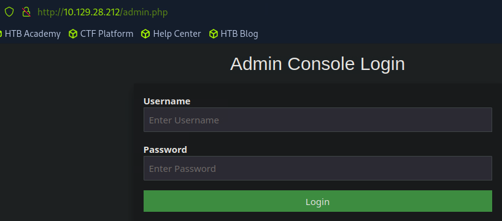
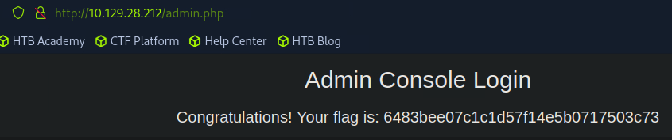

# PREIGNITION


#customapplication #apache #reconnaissance #websitestructurediscovery #defaultcredentials

## 1. Méthodologie

On commence comme d'habitude avec la phase d'énumération avec la commande `nmap -sV IP_cible`:

```
└──╼ [★]$ nmap -sV 10.129.28.212
Starting Nmap 7.94SVN ( https://nmap.org ) at 2025-02-23 05:20 CST
Nmap scan report for 10.129.28.212
Host is up (0.011s latency).
Not shown: 999 closed tcp ports (reset)
PORT   STATE SERVICE VERSION
80/tcp open  http    nginx 1.14.2
```

Le port 80 est ouvert avec un serveur web qui tourne dessus: nginx en version 1.14.2.
Nous allons énumérer maintenant les dossiers et sous-dossiers contenus sur le serveur web avec l'outil `gobuster`: L'option -w permet de spécifier une liste de mots (wordlist) sur laquelle se base la commande pour faire ses requêtes 'get' et l'option -u permet de cibler une URL spécifique (ici notre serveur web). L'option -x permet de spécifier les extensions de pages que l'on cible, ici les pages en '.php.

`gobuster dir -u 10.129.28.212 -w /usr/share/dirb/wordlists/common.txt -x php`

```
└──╼ [★]$ gobuster dir -u 10.129.28.212 -w /usr/share/dirb/wordlists/common.txt -x php
===============================================================
Gobuster v3.6
by OJ Reeves (@TheColonial) & Christian Mehlmauer (@firefart)
===============================================================
[+] Url:                     http://10.129.28.212
[+] Method:                  GET
[+] Threads:                 10
[+] Wordlist:                /usr/share/dirb/wordlists/common.txt
[+] Negative Status codes:   404
[+] User Agent:              gobuster/3.6
[+] Extensions:              php
[+] Timeout:                 10s
===============================================================
Starting gobuster in directory enumeration mode
===============================================================
/admin.php            (Status: 200) [Size: 999]
/admin.php            (Status: 200) [Size: 999]
Progress: 9228 / 9230 (99.98%)
===============================================================
Finished
===============================================================
```

Les pages ayant un statut 200 sont les requêtes 'get' qui ont fonctionnées, donc les pages existent. Nous allons les explorer dans le navigateur web:

```
http://IP_cible/admin.php
```



On va tenter de rentrer avec des ID par défaut, soit admin/admin et cela fonctionne !




## 2. Questions

### Task 1

Directory Brute-forcing is a technique used to check a lot of paths on a web server to find hidden pages. Which is another name for this? (i) Local File Inclusion, (ii) dir busting, (iii) hash cracking.

```
dir busting
```

### Task 2

What switch do we use for nmap's scan to specify that we want to perform version detection

```
-sV
```

### Task 3

What does Nmap report is the service identified as running on port 80/tcp?

```
http
```

### Task 4

What server name and version of service is running on port 80/tcp?

```
nginx 1.14.2
```

### Task 5

What switch do we use to specify to Gobuster we want to perform dir busting specifically?

```
dir
```

### Task 6

When using gobuster to dir bust, what switch do we add to make sure it finds PHP pages?

```
-x php
```

### Task 7

What page is found during our dir busting activities?

```
admin.php
```

### Task 8

What is the HTTP status code reported by Gobuster for the discovered page?

```
200
```

### Flag

```
6483bee07c1c1d57f14e5b0717503c73
```

